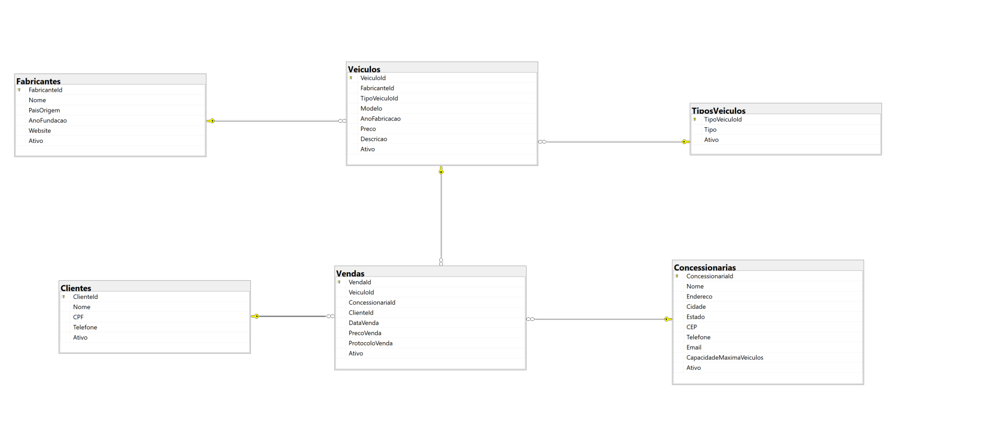

## Concessionarias

Desafio técnico Desafio Intelectah

**Objetivo**: Desenvolver uma aplicação web para a gestão de concessionárias de veículos utilizando
Asp.net MVC e Entity Framework. O sistema deve permitir o gerenciamento de fabricantes de veículos,
veículos, concessionárias e a realização de vendas, integrando autenticação de usuários, relatórios e
otimização de desempenho.

## Funcionalidade trabalhas

### Funcionalidades Básicas

* Cadastro de Fabricantes de Veículos
* Cadastro de Veículos
* Cadastro de Concessionárias
* Realização de Vendas

### Funcionalidades Avançadas

* Relatórios e Dashboards
* Integração com API Externa
* Otimização de Desempenho
* Teste e Documentação

### Tecnologias Utilizadas

* **Frontend**: Bootstrap, JavaScript (AJAX), HTML/CSS
* **Backend**: ASP.NET Core MVC, Entity Framework Core
* **Autenticação**: Identity Framework
* **Banco de Dados**: SQL Server
* **Caching**: Redis
* **Relatórios**: Google Charts 
* **Documentação**: Swagger

### Esquema

#### Como rodar o projeto?

A maneira mais simples de subir o projeto é por meio do docker. Para isso rode o comando: `docker-compose up -d` e navegue para: `http://localhost:4003`

Caso queira rodar localmente:
* Suba uma instância do redis: `docker run -d -p 6379:6379 --name redis redis`
* Selecione a solução e pressione `ALT + ENTER`
* Selecione a opção "Vários projetos de Inicialização"
* Selecione `Concs.Api` e `Concs.Web` para iniciar
* Precione `CTRL + F5` e navegue para: `https://localhost:7090`