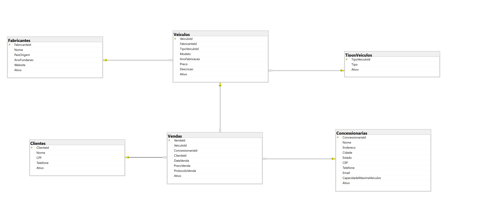
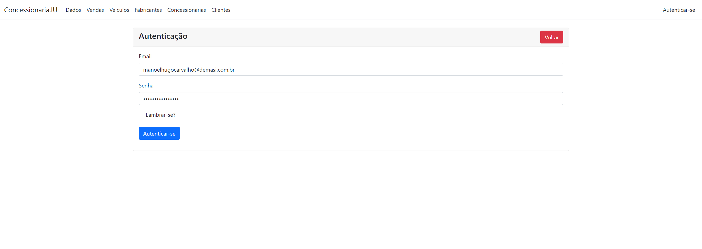
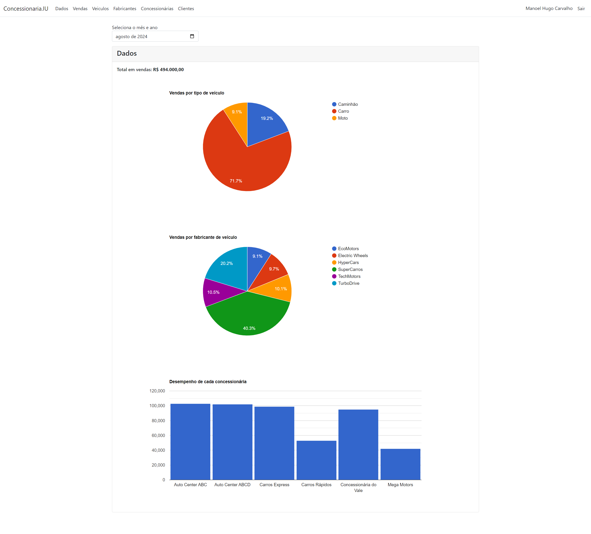
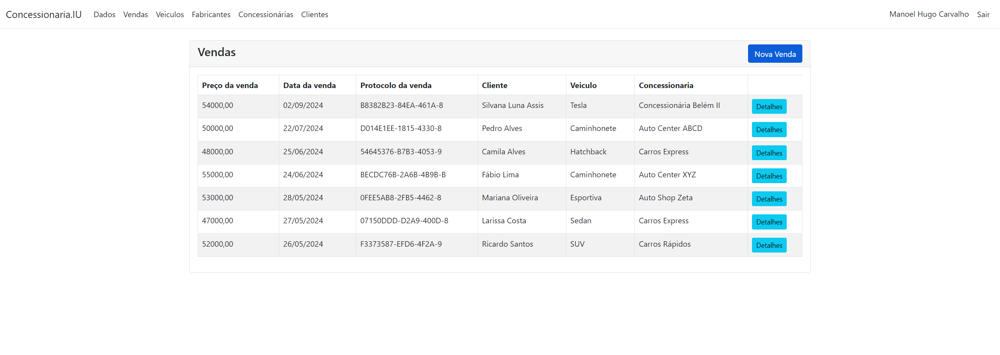
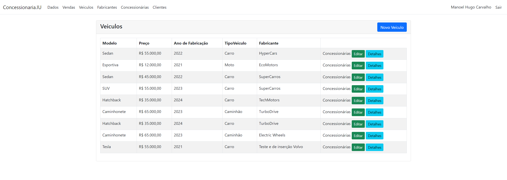

# 1. Introdução ao Projeto
## Concessionarias

Desafio técnico Desafio Intelectah

**Objetivo**: Desenvolver uma aplicação web para a gestão de concessionárias de veículos utilizando
Asp.net MVC e Entity Framework. O sistema deve permitir o gerenciamento de fabricantes de veículos,
veículos, concessionárias e a realização de vendas, integrando autenticação de usuários, relatórios e
otimização de desempenho. 

Para obter mais informações sobre os requisitos consulte a pasta **/docs** 

### Funcionalidades Básicas

* Cadastro de Fabricantes de Veículos
* Cadastro de Veículos
* Cadastro de Concessionárias
* Realização de Vendas

### Funcionalidades Avançadas

* Autenticação e Autorização de Usuários
* Relatórios e Dashboards
* Integração com API Externa
* Otimização de Desempenho
* Teste e Documentação

### Tecnologias Utilizadas

* **Frontend**: Bootstrap, JavaScript (AJAX), HTML/CSS
* **Backend**: .NET Core 6 / ASP.NET MVC, Entity Framework Core 8
* **Autenticação**: Identity Framework
* **Banco de Dados**: Microsoft SQL Server 2022
* **Caching**: Redis
* **Relatórios**: Google Charts 
* **Documentação**: Swagger

# 2 - Configuração do Ambiente
#### Como rodar o projeto?

A maneira mais simples de subir o projeto é por meio do docker. Para isso rode o comando: `docker-compose up -d` e navegue para: `http://localhost:4003`

Caso queira rodar localmente:
* Suba uma instância do redis: `docker run -d -p 6379:6379 --name redis redis`
* Selecione a solução e pressione `ALT + ENTER`
* Selecione a opção "Vários projetos de Inicialização"
* Selecione `Concs.Api` e `Concs.Web` para iniciar
* Precione `CTRL + F5` e navegue para: `https://localhost:7090`

# 3 - Estrutura do Projeto

Este projeto apresenta uma arquitetura Monolítica dividido em camadas.

* Camada de Domínio - o núcleo que define as interfaces de interação entres as outras camadas.
* Camada de Dados - uma abstração para acesso e pesistência das entidades do domínio.
* Camada de Negócio - aplica regras de integridade relacionadas ao negócio. Utiliza as interfaces implementadas pela camada de Dados.  
* Camada Api - interface exposta pelo sistemas à clientes externos. Utiliza as interfaces implementadas pela camada de Negócio. 
* Camada Web - interface de interção do usuário. Cliente da camada de Api. 
* Camada de ID - reponsavel registar os pares <Interface,Implementação> à coleção de serviços disponívies para injeção de depedência. 

# 4 - Banco de Dados

### Esquema

# 5. Testes

* Estratégia de Testes: testes de integração relacionados à camadas de Negócio como Mock da camada de Dados.
* Ferramentas de Teste: xUnit e Moq.

# 6 - Capturas

